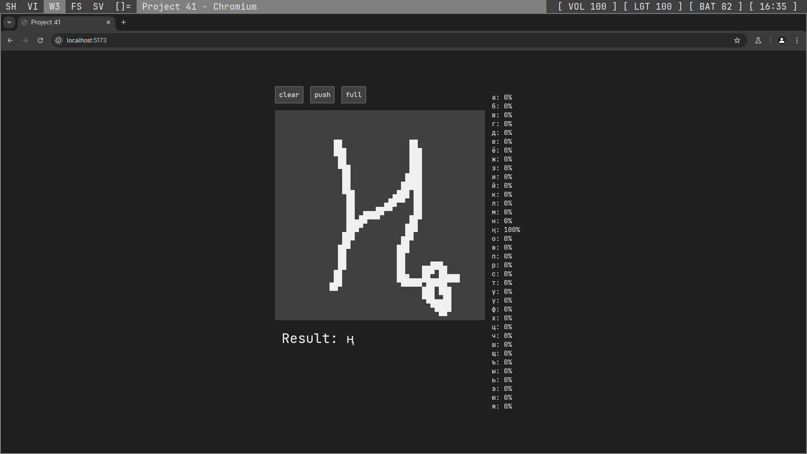

# 41



## Usage

### Train

```
git clone https://github.com/pubfnmain/41
cd 41
python -m venv .venv
source .venv/bin/activate
pip install -r requirements.txt
python model/train.py
```

### Server

```
python server.py
```

### Client

```
cd client
npm run dev
```
